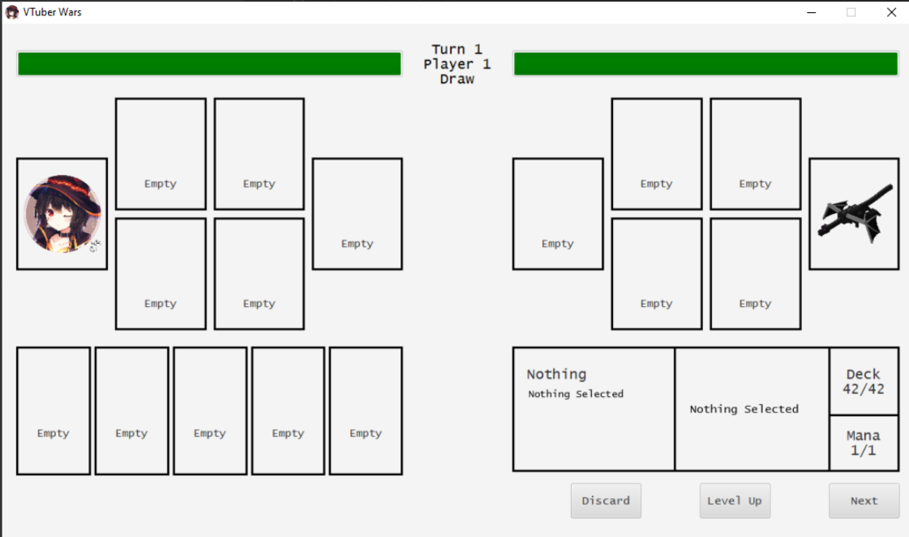
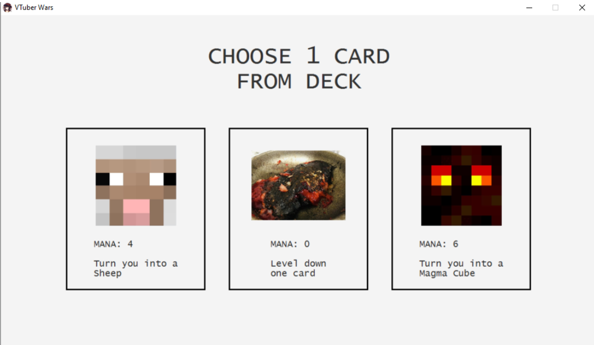
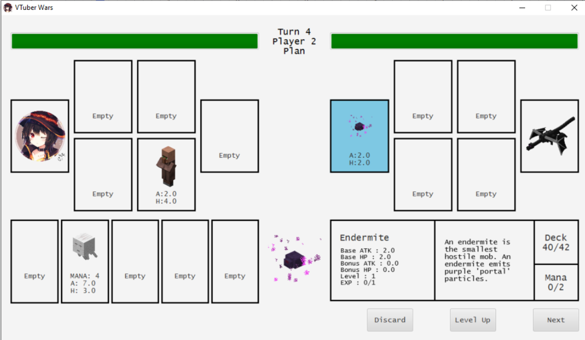

# IF2210 Card Game Project 

## About

This application is about a card game of two person. This app is built by Java and JavaFX for the GUI. Game will start with showing the boardgame in perspective of the first player. The game will continue to the draw pahse when click the next button. This game has 4 phase, draw phase, plan phase, attack phase, and end phase. Player could move to the next phase by click the next button at the right bottom of the window. It will be game over when one of the player health reach 0 or there is no more card in the deck.

## Code Structure
```
src
└───main
    ├───java
    │   └───com
    │       └───vtuberwars
    │           ├───CLI
    │           ├───Jtest
    │           ├───card
    │           │   └───ui
    │           ├───model
    │           │   ├───card
    │           │   ├───cardspace
    │           │   ├───code
    │           │   ├───exception
    │           │   └───player
    │           └───util
    └───resources
        └───com
            └───vtuberwars
                └───card
                    ├───data
                    ├───image
                    │   ├───character
                    │   └───spell
                    │       ├───level
                    │       ├───morph
                    │       ├───potion
                    │       └───swap
                    └───ui
```

## Preqrequisites

Things to have before start this application
* Java 8
* Gradle

## How To Compile

To compile this application, you need to follow this step:
1. Open project root using IntelliJ IDEA
2. Open Gradle
3. Build Project

## How to Run
To run this application, you need to follow this step:
1. Open Gradle using IntelliJ IDEA
2. Choose application, and the click run

## Authors
* **Timothy Stanley Setiawan** - *13520028*
* **Muhammad Akmal Arifin** - *13520037*
* **Andreas Indra Kurniawan** - *13520091*
* **Thirafi Najwan Kurniatama** - *13520157*

## Screenshots



